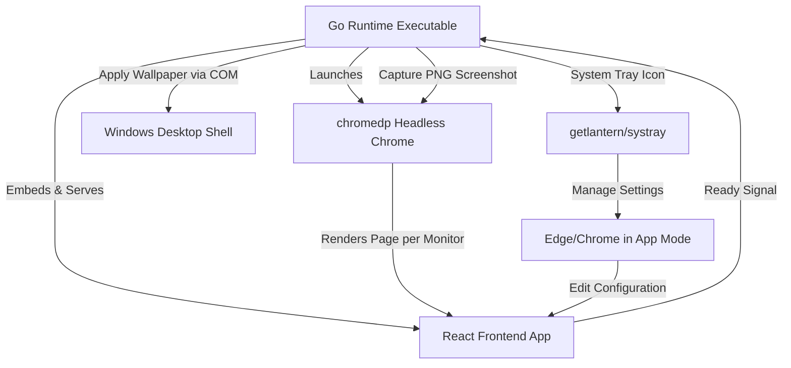

# Live Wallpaper — Project Specification & Architecture (V1)

This document provides a comprehensive overview of the **Live Wallpaper** desktop application. It acts as a detailed blueprint of the existing (V1) architecture, tech stack, features, and native Windows integrations, serving as the foundational reference for developing the **V2 rework**.

---

## 1. Project Objective

**Live Wallpaper** is a native Windows desktop application that converts system desktop backgrounds into a live, interactive status board. 
Instead of rendering active elements directly on the desktop (which consumes heavy resources and interferes with standard Windows shell interactions), the application leverages an **offline capture-and-apply** cycle:
1. It hosts a local web application containing dashboards and status widgets.
2. It runs a headless WebKit/Chrome browser instance in the background to render these dashboards.
3. It takes high-resolution screenshots of the browser viewport.
4. It calls low-level Windows APIs to apply the screenshot as the background image for each specific monitor.

This approach achieves the visual impact of an active HTML desktop dashboard while preserving full Windows desktop icon interactions and operating system stability.

---

## 2. System Architecture

The project splits responsibilities between a lightweight web-based frontend and a Go-based desktop runtime.



### Execution Lifecycle
1. **Startup**: The application launches, sets up logging, starts an embedded HTTP server on a random loopback port (`127.0.0.1:0`), and checks if a configuration file exists.
2. **Setup/Settings (If needed)**: If the configuration file is missing, the application redirects the user to the web settings page immediately, opening it inside a frameless browser window (using Edge or Chrome in `--app` mode).
3. **Splash Screen**: A native WPF window (driven via PowerShell) is shown while the app initializes resources and triggers the first wallpaper render cycle.
4. **Data Polling & Scheduling**: Two independent Go tickers execute at user-defined intervals (e.g., every 30 minutes) to pull fresh data from the active APIs.
5. **Capture & Apply**:
   - The Go runtime invokes `chromedp` (headless Chrome) targeting the loopback URL.
   - It specifies query parameters for the monitor index and the assigned provider (e.g., `http://127.0.0.1:port/?monitor=0&provider=plane`).
   - Headless Chrome renders the page, loading dynamic state and web components.
   - The React frontend signals readiness by posting to a local ready-state API `/api/frontend-ready`.
   - The Go runtime takes a screenshot of the browser viewport at the monitor's native resolution.
   - The Go runtime invokes Windows COM APIs (`IDesktopWallpaper`) to apply the screenshot to that specific monitor.

---

## 3. Technology Stack

The application is structured into three layers: the frontend browser UI, the Go execution runtime, and packaging pipeline tools.

### Frontend (UI)
* **Framework**: React 19 + TypeScript.
* **Build System**: Vite 8 + Tailwind CSS v4.
* **Component Styling**: Tailored Tailwind CSS classes mixed with inline React styles for layout sizing.
* **Assets**: SVG-based custom data visualizations (such as financial charts and sparklines).

### Backend Runtime (Go)
* **Web Server**: `net/http` serving embedded React files (via `go:embed`) and acting as a REST API proxy.
* **Headless Capture**: `github.com/chromedp/chromedp` controlling Chromium-based browsers.
* **Tray Controls**: `github.com/getlantern/systray` for taskbar tray menus.
* **Registry Integration**: `golang.org/x/sys/windows/registry` to manage startup persistence.
* **Window Management / Resource Compilation**: `github.com/tc-hib/go-winres` to write application icons and manifest metadata into the final PE binary.
* **Image Resizing**: `golang.org/x/image/draw` (Catmull-Rom resampling filter) to handle background image cropping.

### Windows Native Integration
* **Win32 DLL Calls**: Directly accesses `user32.dll` to send system parameters (`SystemParametersInfoW`) and present dialog prompts (`MessageBoxW`).
* **COM API Integration**: Implements the `IDesktopWallpaper` COM interface (`ole32.dll`) via pointers to direct virtual method tables (Vtables) in Go, allowing:
  - Retrieval of multi-monitor count.
  - Identification of specific monitor dimensions and boundaries (`GetMonitorRECT`).
  - Assignment of unique wallpaper images to individual monitors (`SetWallpaper`).

### Data Providers & APIs
* **Plane.so API**: Proxy endpoint `/plane-api/` routing REST queries to `https://api.plane.so` to populate Kanban task boards.
* **Weather API**: OpenWeatherMap API (`https://api.openweathermap.org/data/2.5/forecast`) providing 5-day forecasts.
* **Aviation Weather**: Aviation Weather API (`https://aviationweather.gov/api/data/metar`) to query METAR/TAF text feeds.
* **Currency Exchange**: Frankfurter API (`https://api.frankfurter.app/`) to retrieve historical and real-time exchange rates.
* **Update Delivery**: GitHub Releases API (`https://api.github.com/repos/jurgenjacobsen/live-wallpaper/releases/latest`).

---

## 4. Configuration Schema (`live-wallpaper-config.json`)

The application configures itself using a JSON file situated next to the executable.

```json
{
  "configVersion": 2,
  "runOnStartup": true,
  "planeUpdateIntervalMinutes": 10,
  "weatherUpdateIntervalMinutes": 10,
  "plane": {
    "apiKey": "plane_api_xxx",
    "workspaceSlug": "your-workspace",
    "projectId": "PROJECT_ID"
  },
  "weather": {
    "apiKey": "openweathermap_api_key",
    "city": "London",
    "corner": "top-right",
    "backgroundImagePath": "C:\\path\\to\\bg.png",
    "enableMetar": true,
    "enableTaf": true,
    "airports": "EGLL"
  },
  "currency": {
    "baseCurrency": "EUR",
    "targets": ["USD", "BRL"]
  },
  "monitorAssignments": [
    {
      "monitorIndex": 0,
      "provider": "plane",
      "widgets": ["weather"]
    },
    {
      "monitorIndex": 1,
      "provider": "weather",
      "widgets": []
    }
  ]
}
```

### Schema Features:
1. **Config Versioning**: Includes version metrics (`configVersion: 2`) with migration routines in Go (`migrateLegacyIfNeeded`) to upgrade V1 legacy configurations (which supported single-monitor setups or key re-arrangements).
2. **Assignments Matrix**: Maps a `monitorIndex` to a primary background `provider` (`none`, `plane`, `weather`) and a list of secondary floating `widgets` (`weather`, `currency`).

---

## 5. Detailed Feature Breakdown

### A. System Tray Interface
The tray menu provides daily operation and diagnostic control:
* **Open settings**: Invokes the settings window.
* **Open logs**: Opens `live-wallpaper.log` in the user's default text editor.
* **Check for updates**: Requests the latest GitHub release.
* **Run on startup**: A checkbox menu item toggling the registry entry.
* **Update wallpapers**: Forces immediate screenshot recapture and wallpaper updates.
* **Restart**: Launches a new process of the executable and shuts down the current one.
* **Shutdown**: Exits the app cleanly.

### B. Settings & First-Run Form
* On launch, `ensureAppConfig` checks for the config file. If missing, it initiates a setup session.
* Opens the browser settings client in standalone app mode using Microsoft Edge first:
  `msedge.exe --app=http://127.0.0.1:port/?mode=settings`
  If Edge is missing, it tries Chrome (`chrome.exe --app=...`) before falling back to the standard web browser.
* The React Settings form updates all sections, detects available monitor indexes via `/api/monitors`, and posts the new structure to `/api/full-config`.
* Once saved, the settings client alerts Go via `/api/settings-closed`, closing the browser window and initializing the core loop.

### C. Splash Screen
* Written in PowerShell leveraging WPF XAML, it draws a clean loading card centered on the screen.
* Launched hidden inside a background PowerShell runner so that cmd windows do not flash.
* Automatically killed once the first wallpaper capture succeeds.

### D. Main Dashboards & Widgets

#### 1. Plane.so Kanban Board
* Pulls tasks from the Plane API.
* Organizes issues into columns (e.g. Backlog, Todo, In Progress, Done) following project workflows.
* Employs priority indicators and color tags.
* Reserves a horizontal margin space (clamped between 120px and 240px) on the left side of the primary monitor layout to ensure standard desktop icons do not cover the task cards.

#### 2. Weather Forecast
* Retrieves current weather and forecasts using OpenWeatherMap.
* Shows temperature, wind speed, relative humidity, and forecast weather icons.
* Allows user placement in any monitor corner: `top-left`, `top-right`, `bottom-left`, or `bottom-right`.
* Optionally includes **Aviation Weather**: displays raw ICAO METAR and TAF text feeds with color-coded flight category tags:
  - **VFR** (Green)
  - **MVFR** (Blue)
  - **IFR** (Red)
  - **LIFR** (Pink)

#### 3. Currency Market Widget
* Queries Frankfurter API.
* Displays exchange rates against a configurable base currency.
* Renders custom **SVG Sparkline Charts** showing the history of the exchange rate over the last 5 active days.
* Adjusts sparkline paths, fill gradients, and markers dynamically to turn green on upward movements and red on downward movements.

---

## 6. Build and Packaging Pipelines

The project relies on two batch scripts for packaging and builds.

### Executable Build (`build.bat`)
```cmd
call npm run sync:icon
set VITE_PLANE_API_BASE_URL=/plane-api
call npm run build
go run github.com/tc-hib/go-winres@latest simply --icon assets/icon.png --manifest gui
go build -ldflags="-H windowsgui -X main.appVersion=%APP_VERSION%" -o "..\Live Wallpaper.exe" .
```
1. **Frontend Compilation**: Vite compiles assets into `dist/`.
2. **Metadata Embedding**: `go-winres` builds Windows icons (`icon.ico`) and compiles manifest files into `syso` objects embedded into the Go compilation.
3. **Go Compiler**: Generates the binary using `-ldflags="-H windowsgui"` to hide console windows and pass version parameters.

### Installer Packaging (`build-installer.bat`)
* Utilizes **Inno Setup 6** (`ISCC.exe`) to bundle the executable.
* Targets `{localappdata}\Live Wallpaper` to guarantee directory writing access without admin escalation.
* Configures registry options and shortcuts in the installer script [LiveWallpaper.iss](C:/Code/live-wallpaper/installer/LiveWallpaper.iss).

---

## 7. Development Utility Scripts

To assist in client-only debugging, three utility Node scripts exist in the `scripts/` directory:
1. [sync-icon.ts](file:///C:/Users/jurgen/Documents/Code/live-wallpaper/scripts/sync-icon.ts): Synchronizes the icon between frontend public assets and Go resources.
2. [update-wallpaper.ts](file:///C:/Users/jurgen/Documents/Code/live-wallpaper/scripts/update-wallpaper.ts): Orchestrates a headless screenshot capture using Node and `puppeteer` and writes the output directly to the desktop wallpaper via the `wallpaper` npm module.
3. [schedule.ts](file:///C:/Users/jurgen/Documents/Code/live-wallpaper/scripts/schedule.ts): Implements a `node-cron` system to poll the developer environment every 30 minutes, allowing layout validation without running the compiled Go process.

---

## 8. Recommendations & Target Areas for V2

When designing the **V2 rework**, consider addressing the following items identified in V1:
* **Dead Code Cleanup**: Remove the unused background-resizing API code `saveWeatherBackgroundUpload` from `go/setup.go` since no upload handler endpoint currently routes to it.
* **Component Rendering Precedence**: In the current design, if `monitorAssignments` assigns `plane` to a monitor, other widgets (like weather or currency) are bypassed in `App.tsx` even if they are selected in the configuration array. V2 should support rendering overlay widgets on top of the Kanban board layout.
* **Chrome Runtime Dependency**: Headless Chrome must be installed on the host system to allow `chromedp` to bind. V2 could consider using lighter-weight web-rendering wrappers (like Webview2) to reduce browser dependencies.
* **Polling Efficiency**: Replace global refreshes with incremental UI updates or WebSockets if real-time notifications are introduced.
