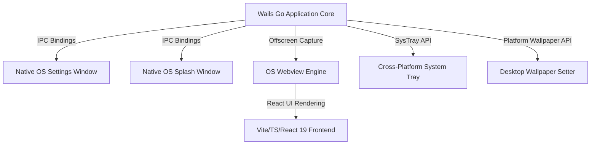

# Live Wallpaper — V2 Rework Plan & Architecture Specification

This document details the plan and structural specifications for upgrading the **Live Wallpaper** desktop app into a highly efficient, clean, cross-platform (Windows, macOS, Linux) application. 

This plan builds upon the details documented in the [PROJECT.md](/Code/live-wallpaper/PROJECT.md) file.

---

## 1. Executive Strategy & Core Principles

The V2 rework aims to solve three main limitations of V1:
1. **Platform Lock-in**: Transition from Windows-only COM/registry bindings to a cross-platform foundation.
2. **Browser Runtime Dependency**: Eliminate the requirement for a pre-installed Google Chrome binary (used by `chromedp` or `puppeteer`).
3. **Embedded Webview Settings**: Replace the browser-app-mode settings window with a true native OS desktop window.

### Key Guidelines
* **Widget Preservation**: The visual styling, fonts, custom SVG sparkline charts, colors, and layout for the Weather and Currency widgets **must stay identical** to the V1 design.
* **Metadata & Trust**: The binary, package details, installer scripts, and system registration must carry complete, unified, and signed app metadata.

---

## 2. Architecture & Technology Stack Upgrades



### Proposed Core Stack

| Component | V1 Stack | V2 Stack |
| :--- | :--- | :--- |
| **App Framework** | Custom Go HTTP Server + chromedp | **Wails V2 / V3** (Go + Native OS WebView) |
| **Frontend Framework**| React 19 + Vite 8 | React 19 + Vite 6+ + TypeScript 5.5+ |
| **Styling Engine** | Tailwind CSS v4 | Tailwind CSS v4 (with identical utility configurations) |
| **Window Management** | Edge/Chrome `--app` launcher | **Wails Runtime Window API** (Native OS window wrapper) |
| **Wallpaper Capture** | Headless Chrome (`chromedp`) | **Webview Offscreen Capture** or native Canvas export |
| **System Tray** | `getlantern/systray` (Windows) | **Wails Native Tray** or `fyne.io/systray` |
| **Installers** | Inno Setup (Windows only) | **GitHub Actions CI/CD** compiling to MSI (Windows), DMG (macOS), and DEB/AppImage (Linux) |

---

## 3. High-Fidelity Adobe-Style Splash Screen

The V2 splash screen will replace the PowerShell-based WPF window with a native borderless, transparent Wails window that mimics modern creative desktop applications (e.g. Adobe Photoshop).

### Design Specifications
1. **Visual Layout**:
   * Fixed size (e.g., `640x360` pixels) with smooth rounded corners.
   * Sleek dark mode styling matching the brand colors, utilizing subtle glowing borders and modern typography.
   * High-quality vector illustration or brand mark centered or aligned to the left.
2. **Dynamic Progress Details**:
   * A thin, accent-colored linear progress bar (no chunky Windows default styles).
   * A status label showing active modules as they initialize:
     * `Loading local configurations...`
     * `Connecting to system monitor services...`
     * `Querying weather API updates...`
     * `Capturing monitor viewports...`
3. **Execution Lifecycle**:
   * Launches instantly upon application startup.
   * Automatically fades out and terminates once the first set of wallpapers is generated and applied to the desktop.

---

## 4. Native OS Settings Window & Layout Preview

The V1 Settings page runs inside Microsoft Edge or Chrome in app mode. In V2, Wails will spawn a **dedicated native OS window** with full IPC (Inter-Process Communication) binding.

### Settings UI Specifications
* **Theme Support**: Options for both **Light and Dark themes** (with Light set as the default). The theme will transition smoothly using CSS variables.
* **Monitor Workspace Layout**:
  * A visual interactive canvas rendering a mockup of the user's monitor setup (retrieved dynamically from the OS).
  * Each monitor block displays:
    * The active background wallpaper preview (either the color gradient, custom uploaded background, or Plane board).
    * Overlay indicators representing the active widgets and their positions.

### Widget Position & Stacking Rules
* Users can position widgets in any of the four corners: `top-left`, `top-right`, `bottom-left`, and `bottom-right`.
* **Stacking Mode**: If multiple widgets (e.g. Weather + Currency) are assigned to the same corner, users can select:
  1. **Stack**: Widgets stack vertically, aligned cleanly with uniform padding.
  2. **Single**: Only one widget can occupy a corner, forcing others to be assigned to different positions.

---

## 5. Intelligent Image Fitting

To prevent distortion, stretching, or unwanted tiling when users upload custom background images of varying resolutions, the Go runtime (or frontend rendering layer) will process the images using a **Cover/Contain Fit** algorithm:

* **Cover Fit (Default)**: Scales the image proportionally so that it completely covers the target monitor dimensions. Part of the image may be cropped if the aspect ratios differ.
* **Contain Fit**: Scales the image so that it is fully visible within the monitor boundaries, filling any remaining space with a blurred, darkened version of the image or a solid background color.
* **Implementation**: Done via the Go canvas/image processing pipeline during the screenshot composition stage or through CSS `background-size: cover` during the webview capture stage.

---

## 6. Target Cross-Platform Wallpaper Adaptors

To support multi-platform wallpaper application, the Go runtime will abstract setting desktop backgrounds:

* **Windows**: Retain the `IDesktopWallpaper` COM interface binding via `syscall` to support multi-monitor setups.
* **macOS**: Integrate with Objective-C APIs (`NSWorkspace.shared.setDesktopImageURL`) using a thin Cgo wrapper or by executing a compiled AppleScript handler.
* **Linux**: Target popular desktop environments (GNOME, KDE Plasma, XFCE) using DBus interface signals or command-line configurations (e.g., `gsettings` for GNOME).

---

## 7. GitHub Actions Release CI/CD Pipeline

The project will automate builds using a GitHub Workflow script, `.github/workflows/release.yml`. It will run on tags (e.g., `v*`) to package and upload binaries to the release assets.

```yaml
name: Release Build

on:
  push:
    tags:
      - 'v*'

jobs:
  build:
    name: Build Release Assets
    runs-on: ${{ matrix.os }}
    strategy:
      matrix:
        os: [windows-latest, macos-latest, ubuntu-latest]
        include:
          - os: windows-latest
            platform: windows/amd64
            output: LiveWallpaper-Setup.exe
          - os: macos-latest
            platform: darwin/universal
            output: LiveWallpaper.dmg
          - os: ubuntu-latest
            platform: linux/amd64
            output: live-wallpaper.deb

    steps:
      - name: Checkout Code
        uses: actions/checkout@v4

      - name: Setup Node.js
        uses: actions/setup-node@v4
        with:
          node-version: 20

      - name: Setup Go
        uses: actions/setup-go@v5
        with:
          go-version: 1.22

      - name: Install Wails CLI
        run: go install github.com/wailsapp/wails/v2/cmd/wails@latest

      - name: Install System Dependencies (Linux)
        if: matrix.os == 'ubuntu-latest'
        run: |
          sudo apt-get update
          sudo apt-get install -y libgtk-3-dev libwebkit2gtk-4.0-dev build-essential

      - name: Build Frontend Assets
        run: |
          npm install
          npm run build

      - name: Build Wails App Package
        run: |
          wails build -platform ${{ matrix.platform }} -clean

      - name: Create DMG Installer (macOS)
        if: matrix.os == 'macos-latest'
        run: |
          # Packaging commands for .dmg creation
          
      - name: Create DEB Package (Linux)
        if: matrix.os == 'ubuntu-latest'
        run: |
          # Packaging commands for .deb creation

      - name: Upload Release Assets
        uses: softprops/action-gh-release@v2
        with:
          files: |
            build/bin/${{ matrix.output }}
        env:
          GITHUB_TOKEN: ${{ secrets.GITHUB_TOKEN }}
```

---

## 8. Widget Extension Concepts (Suggestions for V2+)

*These concepts are suggestions to plan for in the schema, but will not be included in the initial V2 code:*

1. **System Monitor Widget**: Renders circular or linear gauges showing real-time CPU utilization, RAM usage, storage limits, and network traffic rates.
2. **Calendar & Schedule Widget**: Connects to Google Calendar or Outlook via OAuth/REST API to show upcoming events for the day.
3. **Spotify / Media Player Widget**: Displays current playback status, track metadata, progress bar, and album cover art (using DBus on Linux, MRP on Windows, and MusicKit on macOS).
4. **RSS / News Ticker**: Pulls headlines from a list of user-defined RSS feeds, displaying them as a clean scrolling list.
5. **Sticky Notes Widget**: A minimal widget for writing quick text notes directly from the Settings panel onto the desktop.
6. **Clock & Timezone dashboard**: Renders a large minimal clock with secondary clocks showing configured timezones (e.g. UTC, EST).

---

## 9. App Metadata & Trustworthiness

To ensure operating systems do not flag the installer or binary as unsafe, the following guidelines are established for V2:

* **Authenticode & Code Signing**:
  * **Windows**: Configure packaging to support signing via a PFX certificate.
  * **macOS**: Integrate Apple Developer ID signing and notarization steps into the GitHub Actions workflow to prevent gatekeeper warnings.
* **Complete Metadata Fields**:
  * Set `CompanyName`, `LegalCopyright`, `FileDescription`, and `ProductName` variables across all packaging configurations (Windows PE resources, macOS Info.plist, and Linux control packages).
  * Ensure versions are strictly tied to a single semantic source (e.g., `package.json` version).
